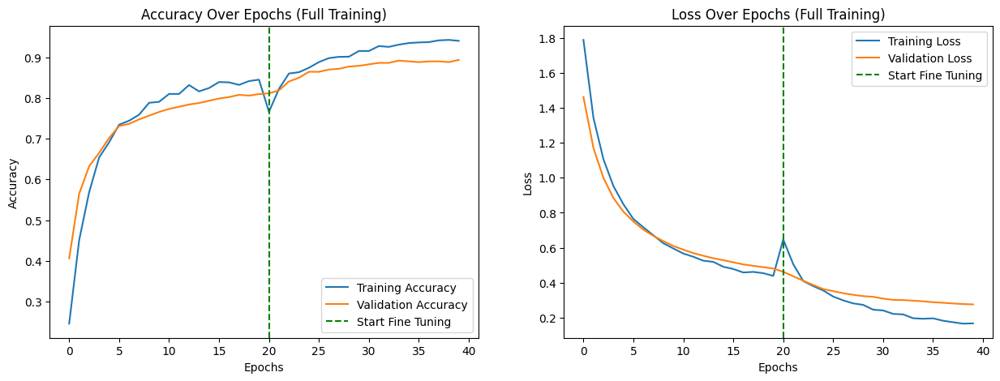
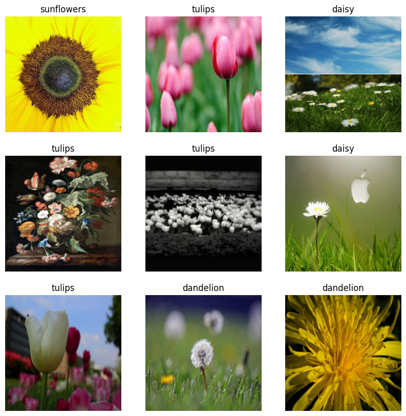
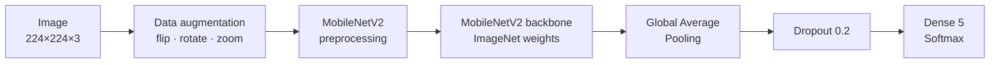
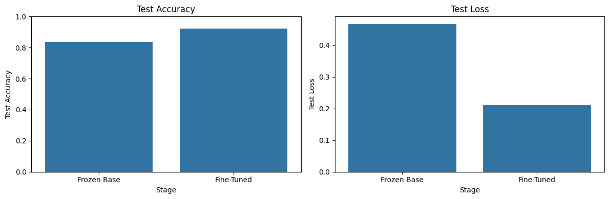
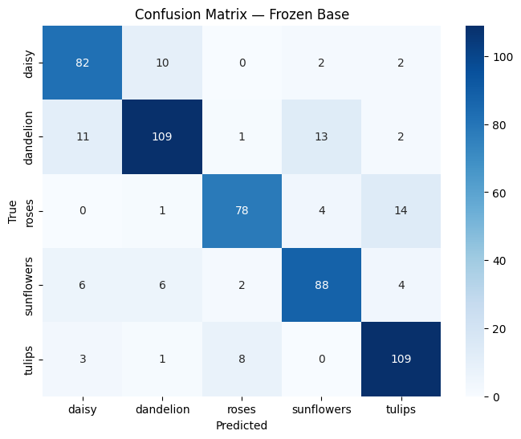
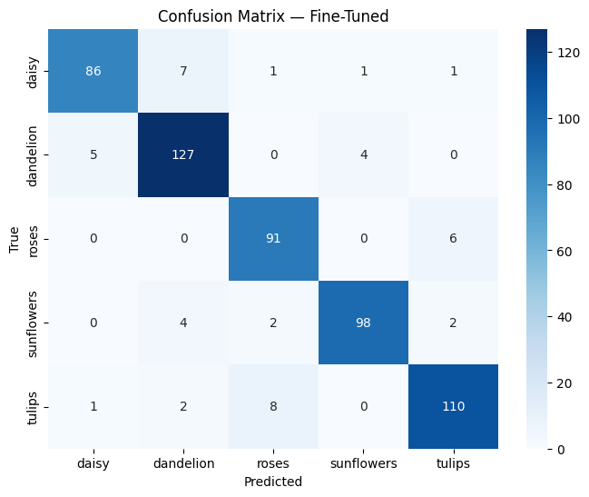
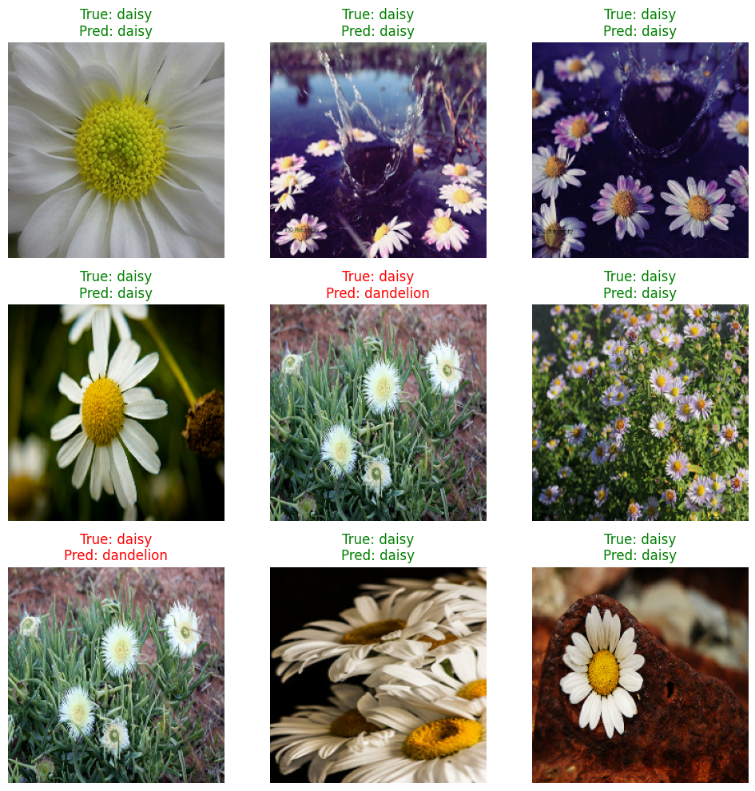

# 🌸 Flower Classification with Transfer Learning & Fine-Tuning

[](https://colab.research.google.com/github/MMujtabaX/CV-assign/blob/main/CV_Assignment_01.ipynb)


Classifying 5 flower species by reusing a **MobileNetV2** network pretrained on ImageNet. It's done in two stages, **feature extraction** with a frozen backbone and then **fine-tuning** the top layers, taking test accuracy from **83.8% to 92.1%** with only ~2,500 training images.

<p align="center">
  
</p>
<p align="center"><sub>Accuracy and loss across both stages. The green dashed line marks the start of fine-tuning.</sub></p>

## 📌 The Dataset

**TF Flowers:** 3,670 photos in 5 classes, downloaded automatically from TensorFlow's public storage, so no Kaggle login or manual upload is needed.

| Class | Images |
|-------|--------|
| 🌼 Daisy | 633 |
| 🌾 Dandelion | 898 |
| 🌹 Roses | 641 |
| 🌻 Sunflowers | 699 |
| 🌷 Tulips | 799 |

The raw download has no train/test split, so the notebook builds a **stratified 70 / 15 / 15 split** (2,567 train, 547 validation and 556 test images) into class-wise folders, copying rather than moving the files.

<p align="center">
  
</p>

## 🧱 Approach



### Stage 1: Feature extraction (frozen backbone)
The whole MobileNetV2 backbone is frozen. Only the new classification head trains: **6,405 parameters** out of 2.26M.

### Stage 2: Fine-tuning
The **last 54 of 154 backbone layers** (from layer 100 onward) are unfrozen (1.87M trainable parameters) and training continues with a **10× lower learning rate** (1e-5), so the pretrained weights are adjusted gently rather than overwritten.

**Design choices**
- **Two-stage training:** a randomly initialized head produces large gradients that would damage pretrained features if the whole network were unfrozen from the start.
- **`training=False` on the backbone:** keeps BatchNorm layers in inference mode during fine-tuning, a common pitfall with MobileNet and EfficientNet.
- **Data augmentation and dropout** to counter the small training set.
- **EarlyStopping + ReduceLROnPlateau + ModelCheckpoint** in both stages, so the best weights are kept automatically.
- A **sanity check** before training: the untrained head scores 15% on validation, close to random guessing (20%) for 5 classes.

## 📊 Results

Evaluated on **556 held-out test images**:

| Stage | Test Accuracy | Test Loss | Trainable Params |
|-------|---------------|-----------|------------------|
| Untrained head (baseline) | ~15% | 1.985 | — |
| Feature extraction (frozen) | 83.8% | 0.468 | 6.4K |
| **Fine-tuned** | **92.1%** | **0.212** | 1.87M |

**Fine-tuning added 8.3 percentage points and more than halved the test loss.**

<p align="center">
  
</p>

### Per-class F1-score

| Class | Frozen | Fine-Tuned |
|-------|--------|------------|
| Daisy | 0.83 | 0.91 |
| Dandelion | 0.83 | 0.92 |
| Roses | 0.84 | 0.91 |
| Sunflowers | 0.83 | **0.94** |
| Tulips | 0.87 | 0.92 |

<table>
  <tr>
    <td></td>
    <td></td>
  </tr>
  <tr>
    <td align="center"><b>Frozen backbone: 90 errors</b></td>
    <td align="center"><b>Fine-tuned: 44 errors</b></td>
  </tr>
</table>

The remaining mistakes concentrate in two pairs of look-alike flowers:
- **Roses ↔ tulips:** 14 confusions (down from 22)
- **Daisy ↔ dandelion:** 12 confusions (down from 21)

Fine-tuning roughly halved the errors in both pairs.

<p align="center">
  
</p>

## 💡 Key Takeaways

- **ImageNet features transfer well to flowers.** Training just a 6K-parameter head reached 84% accuracy.
- **Fine-tuning pays off** when done carefully: freeze first, then unfreeze the top layers with a much lower learning rate.
- **The hardest cases are visually similar classes,** which fine-tuning improves by adapting the high-level filters to petal shapes and textures.
- Both stages kept improving until their final epoch, so **longer training would likely help further.**

## 🔮 Next Steps

- Train each stage for more epochs, since neither had converged
- Try a larger backbone (EfficientNetB0) or higher input resolution
- Stronger augmentation (color jitter, random erasing)
- Learning-rate warmup at the start of fine-tuning

## 🚀 Run It

Click the **Open in Colab** badge above and select a **GPU runtime**, or run it locally:

```bash
pip install tensorflow scikit-learn seaborn matplotlib pandas jupyter
jupyter notebook CV_Assignment_01.ipynb
```

The final model is saved as `flowers_transfer_learning_final.keras`, with the class mapping in `class_names.json`.

## 🙏 Acknowledgements

Transfer-learning diagrams in the notebook are from [Daniel Bourke's TensorFlow Deep Learning course](https://github.com/mrdbourke/tensorflow-deep-learning). The dataset is the [TensorFlow Flowers dataset](https://www.tensorflow.org/datasets/catalog/tf_flowers) (CC BY 2.0).

## 👤 Author

**Muhammad Mujtaba Khan Suri** — CS @ UBIT, University of Karachi
[GitHub](https://github.com/MMujtabaX)
